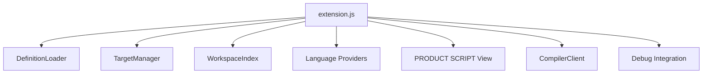
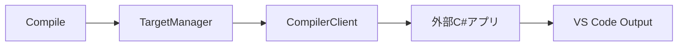
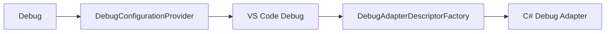

# Product Script Support 構成ファイル解説

現在の `product-script-workspace-fixed.zip` を基準に、各ファイルの役割を整理します。

## 全体構成

```text
ワークスペース
├─ .vscode/
│  ├─ settings.json                 ← プロジェクト設定
│  ├─ product-script/               ← 言語仕様定義
│  └─ extensions/
│     └─ product-script-support/    ← VS Code拡張機能本体
│
└─ Scripts/                         ← 実際のスクリプト
```

---

## ワークスペース側

| ファイル | 役割 | 普段変更する？ |
|---|---|---|
| `.vscode/settings.json` | 拡張機能のワークスペース設定。Root Script一覧、C#コンパイラ、Debug Adapterのパス・引数などを指定 | **する** |
| `.vscode/product-script/language.json` | 独自言語の構文定義。キーワード、スニペット、関数定義・IMPORT・変数などを検出する正規表現を定義 | **する** |
| `.vscode/product-script/functions.json` | `WAIT`、`MESSAGE` 等の独自組み込み関数定義。補完・Hover・Signature Helpの元になる | **する** |
| `README.md` | ワークスペース全体のセットアップ方法・構成・使い方の説明 | 必要に応じて |
| `Scripts/main_01.txt` | Root Scriptのサンプル1 | 実際のスクリプトに置換 |
| `Scripts/main_02.txt` | Root Scriptのサンプル2 | 実際のスクリプトに置換 |
| `Scripts/Common/common.txt` | IMPORTされるサブスクリプトのサンプル | 実際のスクリプトに置換 |

今後の運用で主に触るのは、次の4系統です。

```text
.vscode/settings.json
.vscode/product-script/language.json
.vscode/product-script/functions.json
Scripts/**/*.txt
```

---

# 拡張機能本体

配置場所:

```text
.vscode/extensions/product-script-support/
```

## 基本定義

| ファイル | 役割 | 普段変更する？ |
|---|---|---|
| `package.json` | **拡張機能全体のマニフェスト**。名前、バージョン、Activation、言語登録、コマンド、PRODUCT SCRIPT View、Debugger、設定項目などをVS Codeへ登録 | 機能追加時 |
| `language-configuration.json` | `()`、`[]`、`""` の自動閉じ、単語境界など、エディタとしての基本動作を定義 | 言語仕様変更時 |
| `syntaxes/product-script.tmLanguage.json` | TextMate Grammar。コメント・文字列・数値・変数などの**基本的な色分け**を担当 | 言語仕様変更時 |
| `README.md` | Product Script Support拡張機能自体の説明 | 必要に応じて |

### `package.json` の主な役割

例えば、次の設定で `Scripts` 以下の `.txt` を Product Script として認識します。

```json
"filenamePatterns": [
  "**/Scripts/**/*.txt"
]
```

また、次のようなCommand Paletteの登録も `package.json` で行います。

```text
Product Script: Select Target
Product Script: Compile
Product Script: Debug
```

Explorer内の、

```text
PRODUCT SCRIPT
```

Viewの登録も `package.json` の役割です。

---

# `src/` 共通部分

| ファイル | 役割 |
|---|---|
| `src/extension.js` | **拡張機能のエントリーポイント**。各Provider、View、Compile、Debugなどを生成・VS Codeへ登録する司令塔 |
| `src/config.js` | `settings.json` を読むための共通処理。`${workspaceFolder}`、`${rootScript}` 等の変数展開も担当 |
| `src/targetManager.js` | Compile / Debugする**現在のRoot Script**を管理。候補一覧取得、QuickPickによるTarget選択、選択状態保存を担当 |
| `src/definitionLoader.js` | `.vscode/product-script/language.json` と `functions.json` を読み込み、Extension内部で使いやすい形にする |
| `src/workspaceIndex.js` | `Scripts/**/*.txt` を走査して、スクリプト内で定義されている独自関数などをWorkspace単位でインデックス化 |

## `extension.js`

一番中心になるファイルです。



例えば、次のようなProvider登録を行います。

```javascript
vscode.languages.registerCompletionItemProvider(...)
vscode.languages.registerHoverProvider(...)
vscode.languages.registerDefinitionProvider(...)
```

さらに、

```javascript
vscode.commands.registerCommand(
    'productScript.compile',
    ...
);
```

のように、`Select Target`、`Compile`、`Debug`、`Refresh` などのコマンドもここで結び付けます。

---

# 言語支援

配置場所:

```text
src/language/
```

| ファイル | 役割 |
|---|---|
| `completionProvider.js` | **入力補完**。キーワード、Snippet、`functions.json` の組み込み関数、Workspace内のユーザー定義関数を候補表示 |
| `hoverProvider.js` | マウスHover時の説明。関数のシグネチャ、説明、引数情報などを表示 |
| `signatureHelpProvider.js` | `WAIT(` のように関数入力中に、引数一覧・現在入力中の引数を表示 |
| `definitionProvider.js` | **F12 / 定義へ移動**。独自関数の定義位置や `IMPORT("...")` の参照先ファイルへジャンプ |
| `semanticTokensProvider.js` | キーワード・関数・変数を意味的に判定して色分けする Semantic Highlight を提供 |

## 色分けは2系統

### TextMate Grammar

```text
syntaxes/product-script.tmLanguage.json
```

基本的な字面で判定します。

```text
"ABC"       → 文字列
123         → 数値
!Value      → 変数
// comment  → コメント
```

### Semantic Tokens

```text
src/language/semanticTokensProvider.js
```

言語定義を考慮して、例えば、

```text
IF
WAIT
!Value
```

などを、

```text
keyword
function
variable
```

として意味的に分類します。

将来的に言語仕様を充実させる場合はこちらの方が強力です。

---

# Compile関連

配置場所:

```text
src/compile/
```

| ファイル | 役割 |
|---|---|
| `compilerClient.js` | `.vscode/settings.json` に指定された**外部C#コンパイラを起動**し、選択中のRoot Scriptを渡す |

処理の流れ:



例えば、

```json
"productScript.compiler.arguments": [
  "compile",
  "${rootScript}"
]
```

なら、

```text
ScriptCompiler.exe
    compile
    C:\...\Scripts\main_01.txt
```

という形で呼び出します。

さらにオプションで、

```json
"productScript.compiler.diagnosticsMode": "json"
```

にすると、C#側のJSON結果をVS CodeのDiagnosticへ変換できる骨格もあります。

---

# Debug関連

配置場所:

```text
src/debug/
```

| ファイル | 役割 |
|---|---|
| `debugConfigurationProvider.js` | VS Codeに渡すDebug Configurationを生成・補完する。選択中のTargetを `program` に設定 |
| `debugAdapterDescriptorFactory.js` | `.vscode/settings.json` で指定された**外部C# Debug Adapter**を実際に起動する |

処理の流れ:



役割分担は次の通りです。

```text
debugConfigurationProvider.js
    → 何をデバッグするか

debugAdapterDescriptorFactory.js
    → どのDebug Adapter.exeを起動するか
```

---

# PRODUCT SCRIPT View

配置場所:

```text
src/ui/
```

| ファイル | 役割 |
|---|---|
| `productScriptTreeProvider.js` | Explorerの **PRODUCT SCRIPT** View の内容を生成 |

現在表示している、

```text
PRODUCT SCRIPT

🎯 Target: main_01.txt
✓ Compile
▷ Debug
```

を作っているのがこのファイルです。

各項目をクリックすると、

```text
Target
    → productScript.selectTarget

Compile
    → productScript.compile

Debug
    → productScript.debug
```

という、`extension.js` で登録したコマンドを呼びます。

---

# 今後どこを触るか

| やりたいこと | 主に変更するファイル |
|---|---|
| Root Scriptを増減 | `.vscode/settings.json` |
| C#コンパイラの接続 | `.vscode/settings.json` |
| C# Debug Adapterの接続 | `.vscode/settings.json` |
| キーワード追加 | `language.json` |
| Snippet追加 | `language.json` |
| 組み込み関数追加・変更 | `functions.json` |
| コメント・文字列・変数構文変更 | `language.json` / `product-script.tmLanguage.json` |
| Completionの挙動変更 | `completionProvider.js` |
| Hover変更 | `hoverProvider.js` |
| F12動作変更 | `definitionProvider.js` |
| PRODUCT SCRIPT View変更 | `productScriptTreeProvider.js` |
| Compile連携仕様変更 | `compilerClient.js` |
| DAP起動方法変更 | `debugAdapterDescriptorFactory.js` |
| Extension全体の機能登録 | `package.json` / `extension.js` |

---

# 設計上の基本方針

今回の設計では、

> 日常的な言語仕様変更はなるべく `.vscode/product-script/*.json` だけで済ませ、`src/*.js` は仕組みそのものを変えるときだけ触る

という境界にしています。

これにより、仕向けごとの言語仕様変更をGitリポジトリ側の定義ファイルで吸収しやすくし、拡張機能本体のメンテナンス量を抑える構成にしています。
